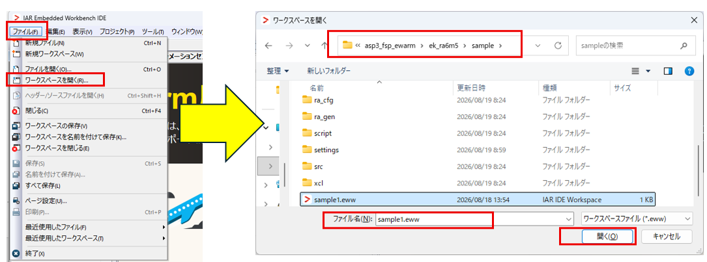
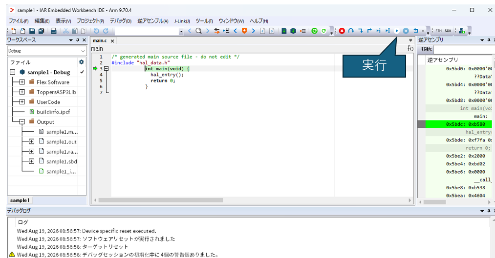
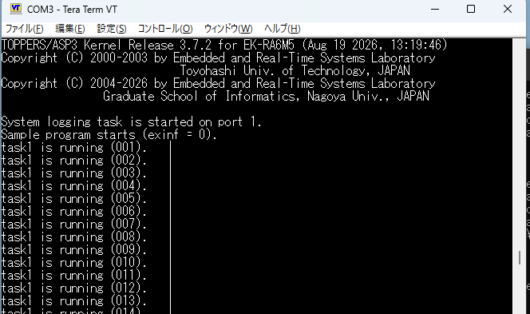

# TOPPERS/ASP3の EWARM向けのRenesas拡張機能対応
sampleの説明

## ターゲット
- [EK-RA6M5](https://www.renesas.com/ja/design-resources/boards-kits/ek-ra6m5?srsltid=AfmBOooxOIRvtPF3k4PRvCM5RuOCfogtJXSP6W-tii1L4Szs8DY4t46m)

- UART-USB変換器が必要です。私はFT231X USBシリアル変換モジュール（https://akizukidenshi.com/catalog/g/g106894/ ） を使用しました。

EK-RA6M5のデバッグUSBポートとPCを接続し、USBシリアルと、RX(J23-pin0)、TX(J24-pin1)、GND(J18-pin7)を接続して、TeraTermなどでシリアル接続します。ボーレートは115200bpsです。

実際の接続の接続した例がこちらです。

## 対応コンパイラ
IAR Embedded Workbench for ARM（EWARM)を使用。
今回使用したバージョンは9.70.4になります。

| ツール | コマンド名 | 
|---|---|
|Cコンパイラ | iccarm.exe |
|アセンブラ |  iasmarm.exe |
|リンカ     |  ilinkarm.exe |
|SREC生成  |  ielftool.exe |

## 関連ツール
| ツール | コマンド名 | 
|---|---|
|CMake |  インストールしてPATHに設定してください。|
|PYTHON     |インストールしてPATHに設定してください。 |
|Ninja  |  EWARMにインストールしたものが利用できます。EWARMインストールフォルダの\common\binにあるので、ここもPATH設定してください。 |
|TeraTerm     |UARTの送受信に使用します |


## コードのダウンロード

![Gitクローン]

適当な場所に作業フォルダを作成し、クローンしてください。

```commandshell
git clone --recursive  https://github.com/iar-kk-akaboshi/asp3_fsp_ewarm.git
```

## \ek_ra6m5\sampleの説明
このプロジェクトは、FSPのコード生成、EWARM設定などが終わっている状態です。
そのため簡単にプログラムを動かすことが出来るようになっています。
FSPの設定、EWARM設定が知りたい方は\ek_ra6m5\sample1を確認ください。


## プロジェクトのビルド
### cfgに対応したライブラリを作成します。

フォルダ\ek_ra6m5\sampleに移動してコマンドラインで以下を実行します。これにより\sample\build\Debug\asp3 にlibasp3.aとlibasp3syssvc.aのライブラリが作成されます。
```text
cmake --preset Debug
cmake --build build\Debug
```

### EWARMによるユーザコードのビルド
EWARMを起動し、ワークスペースを読み込みます。
EWARMのメニュー[ファイル]-[ワークスペースを開く]で、\ek_ra6m5\sampleの下にあるsample1.ewwを選択し、[開く]をクリックします。


EWARMの[メイク]をクリックします。エラーがゼロであれば、[ダウンロードしてデバッグ]をクリックすることで、プログラムの書き込みを実施します。


ダウンロードが終了するとEWARMはデバッグモードになります。EWARMの[実行]をクリックすることで、プログラムが動作を開始します。



シリアルポートからTOPPERSのバナーが表示され、サンプル１の動作が始まります。


