# TOPPERS/ASP3の EWARM向けのRenesas拡張機能対応
sample1の説明


## ターゲット
- [EK-RA6M5](https://www.renesas.com/ja/design-resources/boards-kits/ek-ra6m5?srsltid=AfmBOooxOIRvtPF3k4PRvCM5RuOCfogtJXSP6W-tii1L4Szs8DY4t46m)

- UART-USB変換器が必要です。私はFT231X USBシリアル変換モジュール（https://akizukidenshi.com/catalog/g/g106894/ ） を使用しました。

EK-RA6M5のデバッグUSBポートとPCを接続し、USBシリアルと、RX(J23-pin0)、TX(J24-pin1)、GND(J18-pin7)を接続して、TeraTermなどでシリアル接続します。ボーレートは115200bpsです。

実際の接続の接続した例がこちらです。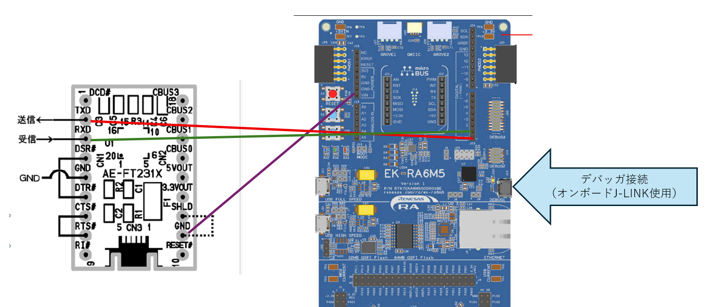 

## 対応コンパイラ
IAR Embedded Workbench for ARM（EWARM)を使用。
今回使用したバージョンは9.70.4になります。

| ツール | コマンド名 | 
|---|---|
|Cコンパイラ | iccarm.exe |
|アセンブラ |  iasmarm.exe |
|リンカ     |  ilinkarm.exe |
|SREC生成  |  ielftool.exe |

## 関連ツール
| ツール | コマンド名 | 
|---|---|
|Renesas FSP | ここではバージョン6.2.0を使用しました|
|CMake |  インストールしてPATHに設定してください。|
|PYTHON     |インストールしてPATHに設定してください。 |
|Ninja  |  EWARMにインストールしたものが利用できます。EWARMインストールフォルダの\common\binにあるので、ここもPATH設定してください。 |
|TeraTerm     |UARTの送受信に使用します |


## コードのダウンロード

![Gitクローン]

適当な場所に作業フォルダを作成し、クローンしてください。

```commandshell
git clone --recursive  https://github.com/iar-kk-akaboshi/asp3_fsp_ewarm.git
```

## \ek_ra6m5\sample1の説明
このプロジェクトは、FSPのプロジェクト作成、EWARMのオプションなどを含めて自分で実施するものです。
また,sample1フォルダのex1.cfg, ex1.c, ex1.hがユーザコードとしているので、今後自分のプログラムを作成するベースになると思います。


## プロジェクトのビルド
### FSPプロジェクトの作成
FSPを起動し、[File]-[New]-[FSP Project...]を選択し、Project Nameを[sample1]、Locationを[\ek_ra6m5\sample1]にして、[Next]をクリックします。
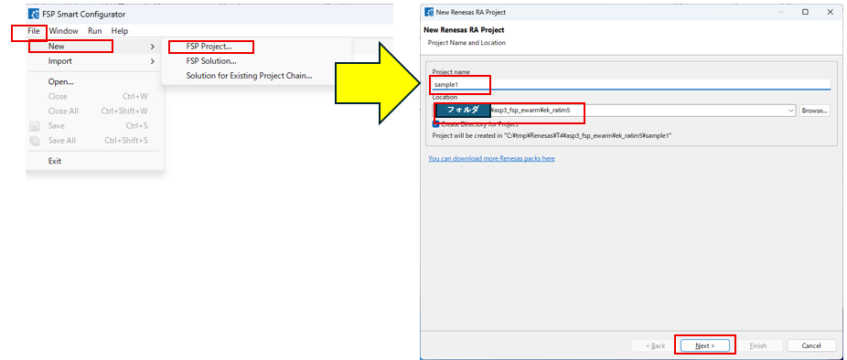

Boardを[EK-RA6MA]、IDE Project Typeを[IAR EWARM[v.9.60+]]を設定し、[Next]をクリック。つづいて、Project Type Selectionで[Flat(Non-TrustedZone) Project]を選択し、[Next]をクリック。
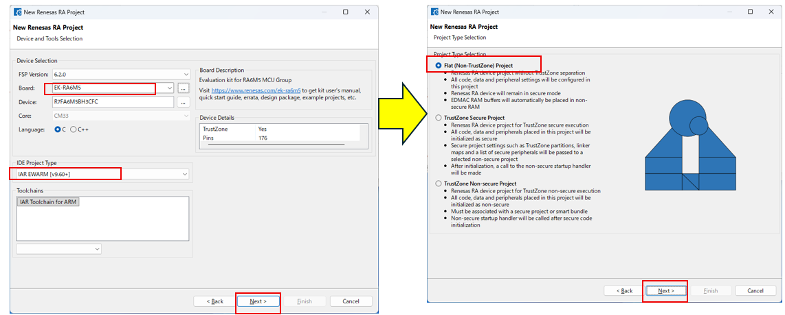


Use Smart Bundleのチェックは無しのままで、[Next]をクリック。つづいて、RTOS Selectionを[No RTOS]で[Next]をクリック。
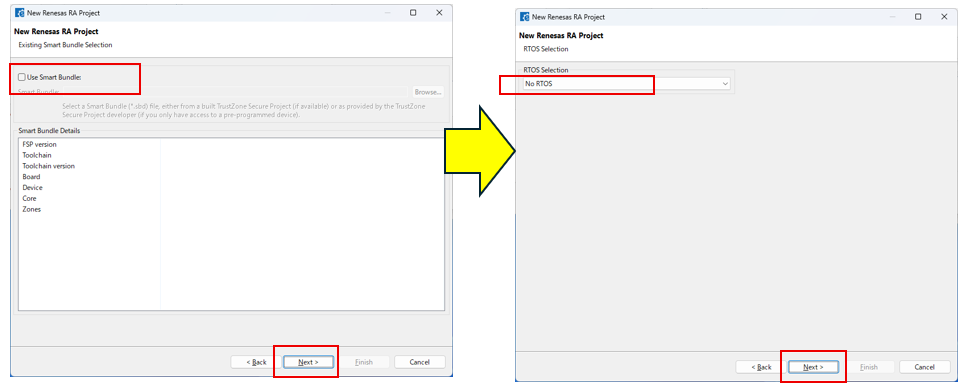

Project Template Selectionで[Bare Metal Minimal]を選択し、[Next]をクリックすると、FSP設定画面が現れます。
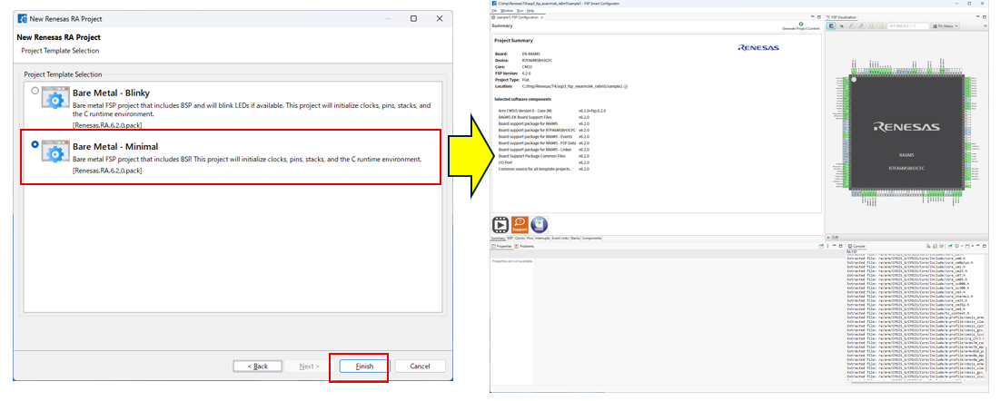


Stacksタブを選択し、1.[Stacks]を選び、2.[g_ioport I/O Port]を選択すると、画面下側にSettingが見えます。設定画面が同一か確認ください。
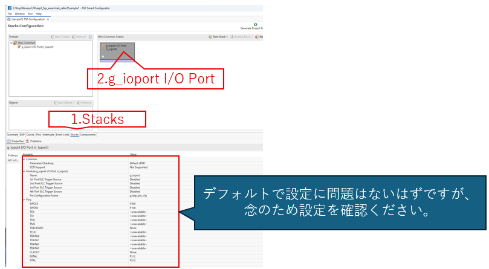

Stacksタブのまま、[New Stack]-[Connectivity]-[UART(r_sci_uart)]を選択します。
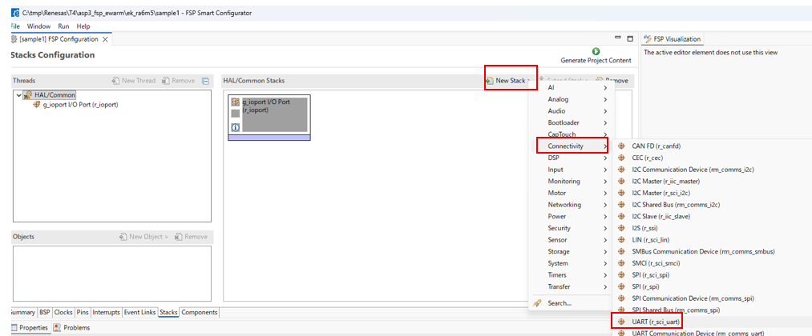

さきほど生成したg_uart0 UART(r_sci_uart)の設定を行います。正しく設定しないとプログラムが正しく動作しませんので、確認しながら進めてください。
1. [g_uart0 UART(r_sci_uart)]をクリック
2. [General]-[Channel]を ７に変更
3. [Interrupt]-[Callback]を target_uart_handler に変更
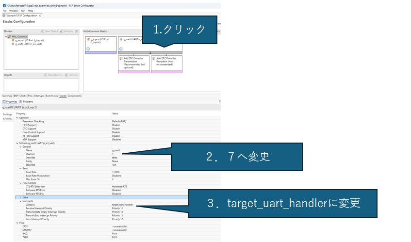


Stacksタブのまま、[New Stack]-[Timers]-[Timer, General PWM(r_gpt)]を選択します。
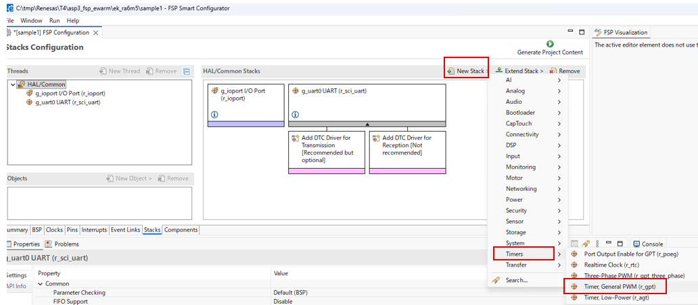


1. [g_timer0 Timer, General PWM(r_gpt)]をクリック
2. [General]-[Compare Match A]で
    - [status]をEnableに
    - [Compare match value]を 0x100,000,000に変更
3. [General]-[Compare Match A]
    - [Period]を0x100,000,000に変更
4. [Interrupt]
    - [Callback]をtarget_hrt_handler に
    - [Capture/Compare match A Interrupt..]をPriority 0(highest)
    - [Capture/Compare match B Interrupt..]をPriority 1に変更

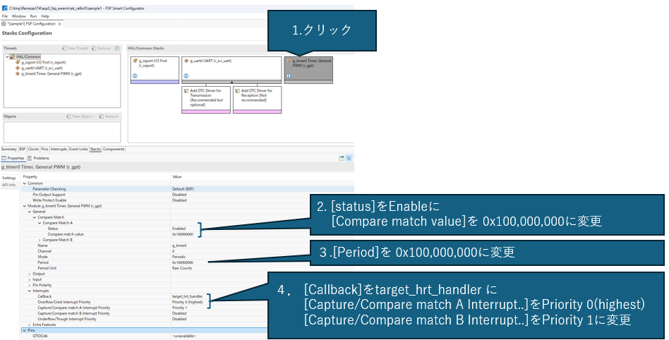


ここまでで設定が終わったので、Interruptsタブを選びAllocationの設定を確認します。
1. [Interrupts]を選択し、
2. Allocationを確認してください。

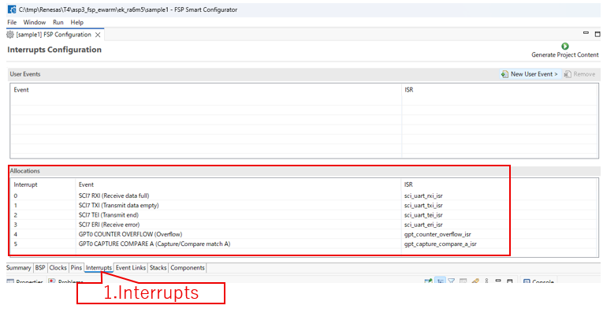


確認が終わったら、コード生成を実施します。
1. [Generate Project Content]をクリックしてください

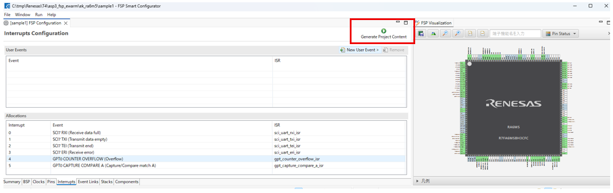

これにより \ek_ra6m5\sample1にコードが生成されています。

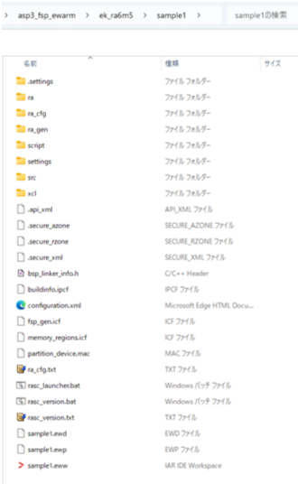


### sample1.orgの内容をsample1にコピー
sample1.orgの内容をsample1に上書きコピーします。これはFSPで新規プロジェクトを作る場合に、前もってフォルダがあるとプロジェクト作成ができないためです。
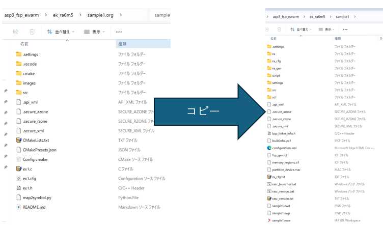

### コードの確認
sample1フォルダにex1.c, ex1.h, ex1.cfgがあります。

ex1.cの内容
```ex1.c
#include <kernel.h>
#include <t_syslog.h>
#include <t_stdlib.h>
#include "syssvc/serial.h"
#include "syssvc/syslog.h"
#include "kernel_cfg.h"
#include "ex1.h"

void
task(EXINF exinf) {
      	syslog(LOG_NOTICE, "Start Task");

        while(1) {
        }
}
```

ex1.hの内容
```ex1.h
#include <kernel.h>
#define MID_PRIORITY	10
#define	STACK_SIZE		4096		/* タスクのスタックサイズ */

extern void	task(EXINF exinf);
```

ex1.cfgの内容
```ex1.cfg
#ifndef TOPPERS_OMIT_TECS
INCLUDE("tecsgen.cfg");
#else /* TOPPERS_OMIT_TECS */
INCLUDE("syssvc/syslog.cfg");
INCLUDE("syssvc/banner.cfg");
INCLUDE("syssvc/serial.cfg");
INCLUDE("syssvc/logtask.cfg");
#endif /* TOPPERS_OMIT_TECS */

#include "ex1.h"

CRE_TSK(TASK1, { TA_ACT, 1, task, MID_PRIORITY, STACK_SIZE, NULL });

```


\sample1\CMakeLists.txtの中でこれらのコードを指定するために、以下の記述があります。
```
# 例えば、sampleフォルダのex1.cfgを使用する場合はこちら
set(ASP3_APPLDIR  ${CMAKE_CURRENT_LIST_DIR})
set(ASP3_APPLNAME ex1)

```


### cfgに対応したライブラリを作成します。

フォルダ\ek_ra6m5\sample1に移動してコマンドラインで以下を実行します。これにより\sample\build\Debug\asp3 にlibasp3.aとlibasp3syssvc.aのライブラリが作成されます。
```text
cmake --preset Debug
cmake --build build\Debug
```

### EWARMによるユーザコードのビルド
#### EWARMを起動し、ワークスペースを読み込みます。
EWARMのメニュー[ファイル]-[ワークスペースを開く]で、\ek_ra6m5\sample1の下にあるsample1.ewwを選択し、[開く]をクリックします。
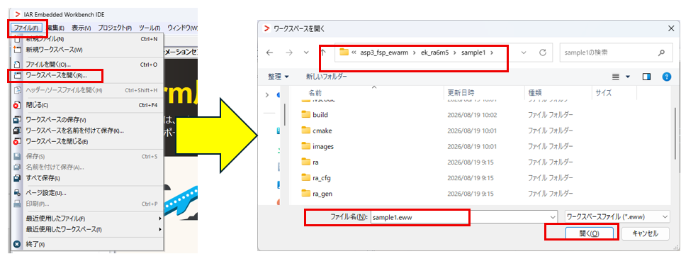

#### ワークスペースでグループToppersAsp3Libを作成
ワークスペース画面で[sample1-Debug]を選択右クリックを行い、[追加]-[グループの追加]をクリックします。そこで、グループ名を[ToppersAsp3Lib]を入力し、[OK]をクリックします。
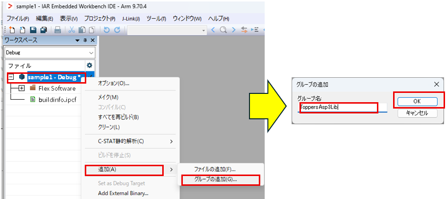


#### ワークスペースでグループUserCodeを作成

ワークスペース画面で[sample1-Debug]を選択右クリックを行い、[追加]-[グループの追加]をクリックします。そこで、グループ名を[UserCode]を入力し、[OK]をクリックします。
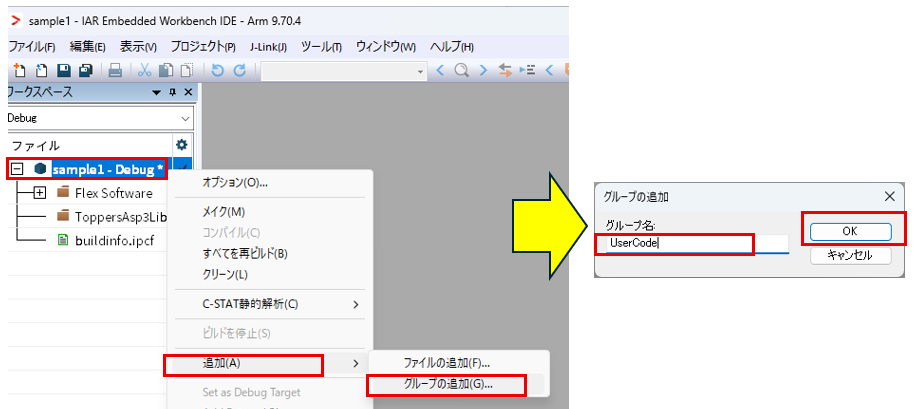

#### プロジェクトへライブラリ追加
sample1\build\Debug\asp3の下に２つのライブラリ*.aが生成されています。
その２つをToppersAsp3Libに対してドラッグ＆ドロップします。
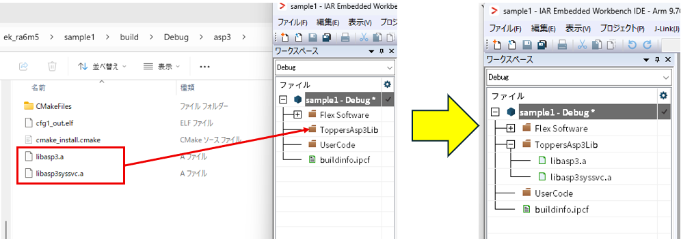

#### ユーザコード(*.c)の追加
今回は、ex1.cがユーザコードとなりますので、そのex1.cをUserCodeにドラッグ＆ドロップします。

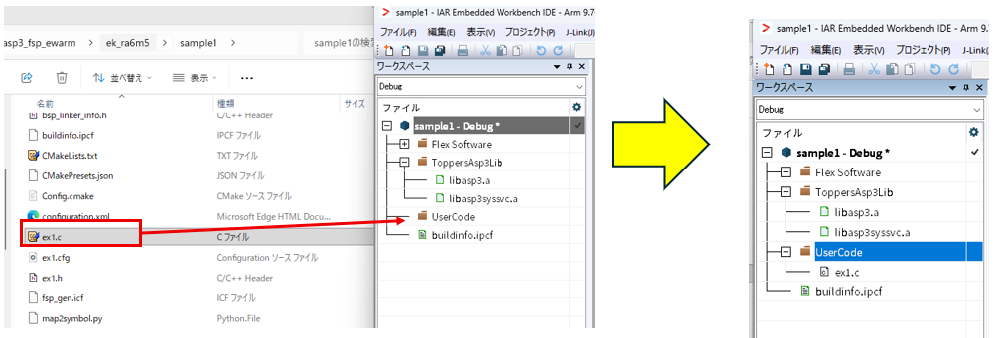

#### プロジェクトオプションの追加
EWARMでプロジェクトオプションを開くために、[sample1-Debug]の右側にある✓をダブルクリックします。
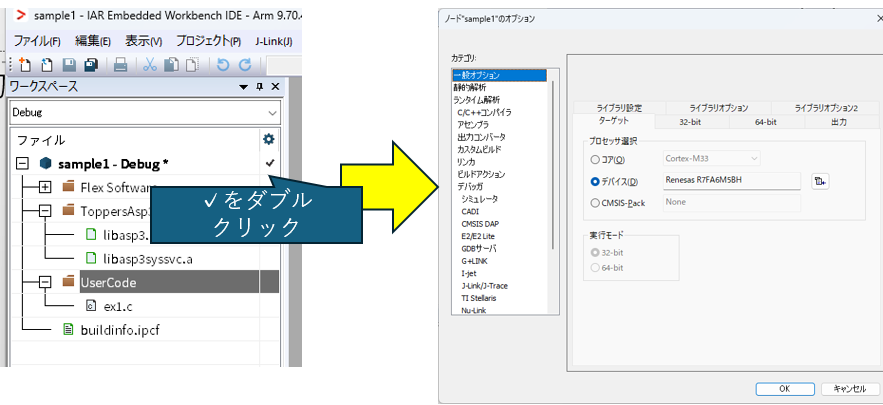

オプション設定画面でカテゴリ[C/C++コンパイラ]を選択し、[プリプロセッサ]タブをクリックします。ここでインクルードディレクトリの設定やシンボル定義（マクロ定義）の設定が可能です。
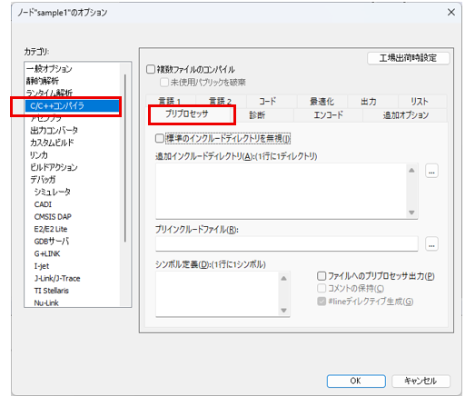


インクルードディレクトリには以下を指定します。今回ユーザコードはプロジェクトフォルダに配置しています（\ek_ra6m5\sample1）が、プロジェクトフォルダは`$PROJ_DIR$`で指定しています。この`$PROJ_DIR$`を使う事で相対パスで指定することが可能になり、異なったプロジェクトでも相対パスが正しければそのまま適用できます。

```
$PROJ_DIR$\ra\arm\CMSIS_6\CMSIS\Core\Include 
$PROJ_DIR$\ra\fsp\inc 
$PROJ_DIR$\ra\fsp\inc\api 
$PROJ_DIR$\ra\fsp\inc\instances 
$PROJ_DIR$\ra_cfg\fsp_cfg 
$PROJ_DIR$\ra_cfg\fsp_cfg\bsp 
$PROJ_DIR$\ra_gen 
$PROJ_DIR$\src 
$PROJ_DIR$\
$PROJ_DIR$\..\..\asp3\asp3_core\sample 
$PROJ_DIR\build\Debug 
$PROJ_DIR$\..\..\asp3\asp3_core\include 
$PROJ_DIR$\..\..\asp3\target\ek_ra6m5 
$PROJ_DIR$\..\..\asp3\arch\arm_iar_iccarm\ra6m5_fsp 
$PROJ_DIR$\..\..\asp3\arch\arm_iar_iccarm\common 
$PROJ_DIR$\..\..\asp3\arch\iccarm
$PROJ_DIR$\..\..\asp3\asp3_core 
$PROJ_DIR$\build\Debug\generated
```
上記の記述を以下の追加インクルードディレクトリに追加してください。また、ユーザコードを他フォルダに配置した場合は、適宜追加してください。


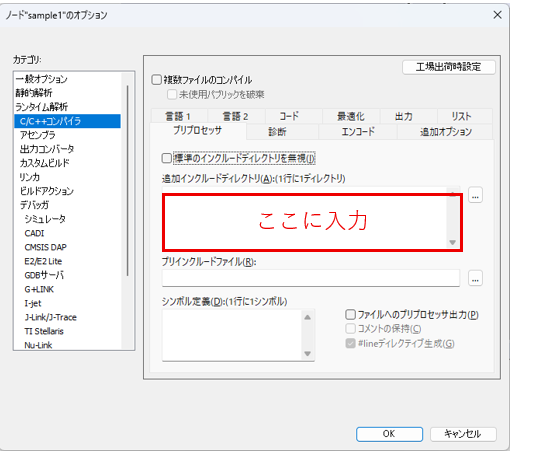


次にマクロ定義を行います。

```
RA6M5 
TOPPERS_CORTEX_M33 
TOPPERS_ENABLE_TRUSTZONE 
TOPPERS_FPU_CONTEXT 
TOPPERS_FPU_ENABLE 
TOPPERS_FPU_LAZYSTACKING 
TOPPERS_OMIT_TECS 
USE_TIM_AS_HRT 
_RA_CORE=CM33 
_RA_ORDINAL=1 
_RENESAS_RA_ 
__TARGET_ARCH_THUMB=5 
__TARGET_FPU_FPV4_SP

```
上記の記述を以下のシンボル定義に追加ください。

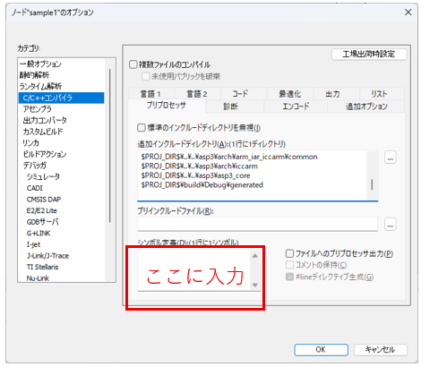

ここまでで設定が終了となります。オプション画面は[OK]をクリックして閉じてください。

#### ビルドの実施
設定が完了したので、ビルドを実施します。いくつか方法はありますが、下図の[メイク]をクリックするのが簡単です。
メイクを実施しても、初回はコード生成などが実行されるのでかなり待ちます（私のPCでは2分程度）。すこしお待ちください。
この待ち時間が経過すると、コンパイルがスタートします（ビルド画面に表示されます）。完了したらエラーがゼロであることを確認します。

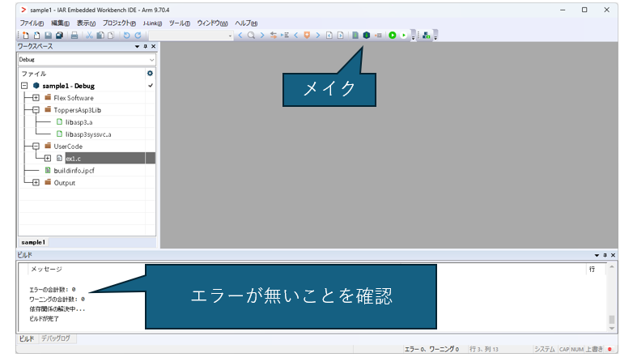

#### ダウンロードして実行まで
ビルドが完了したら、EWARMの[ダウンロードしてデバッグ]をクリックして、フラッシュに書き込みます。


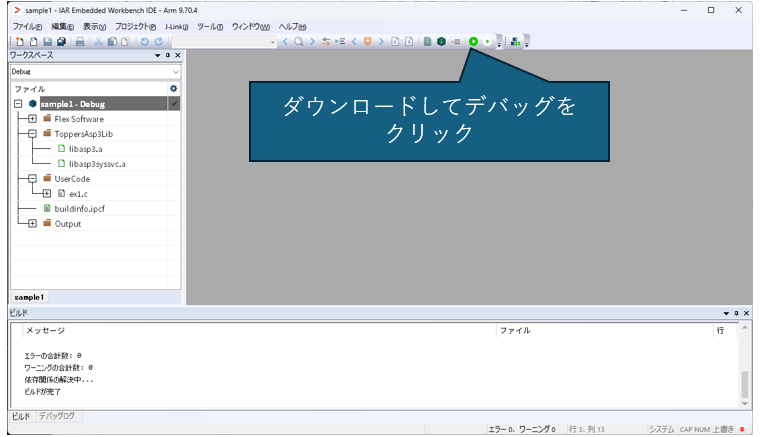

この段階でTeraTermを起動し、UART接続を確立しておきます。
ダウンロードが完了するとEWARMはデバッグモードになります。EWARMの[実行]をクリックすると、プログラムが実行されます。
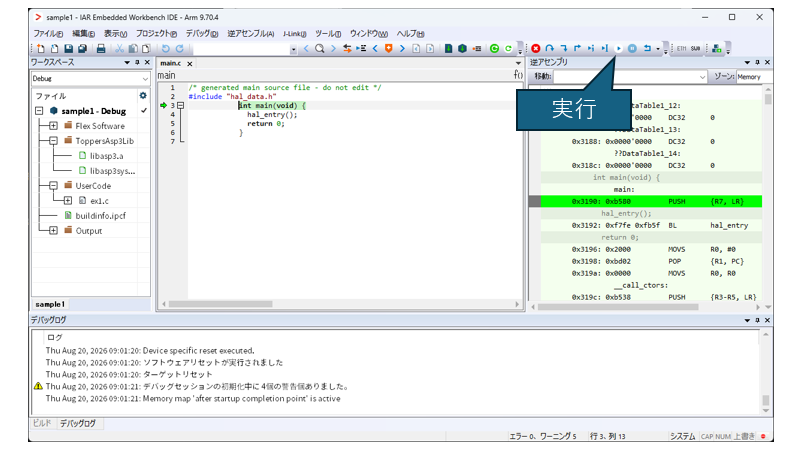

シリアルポートからTOPPERSのバナーが表示され、サンプル１の動作が始まります。これによりUARTでは"Start Task"が表示されます。今回作成したプログラムex1.cはこのUART出力以降はwhile(1)で無限ループとなっています。あとは、使う皆さんが適宜処理を加えていただければと思います。

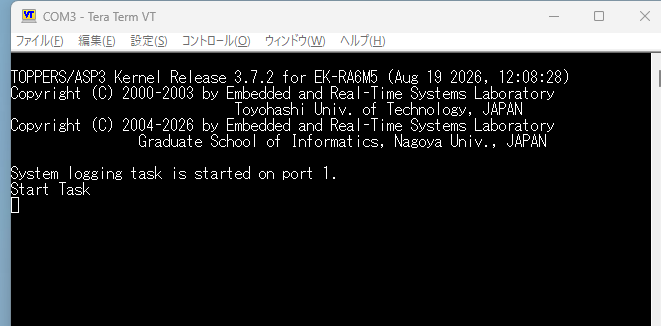


